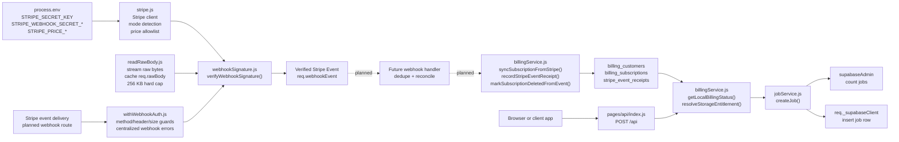
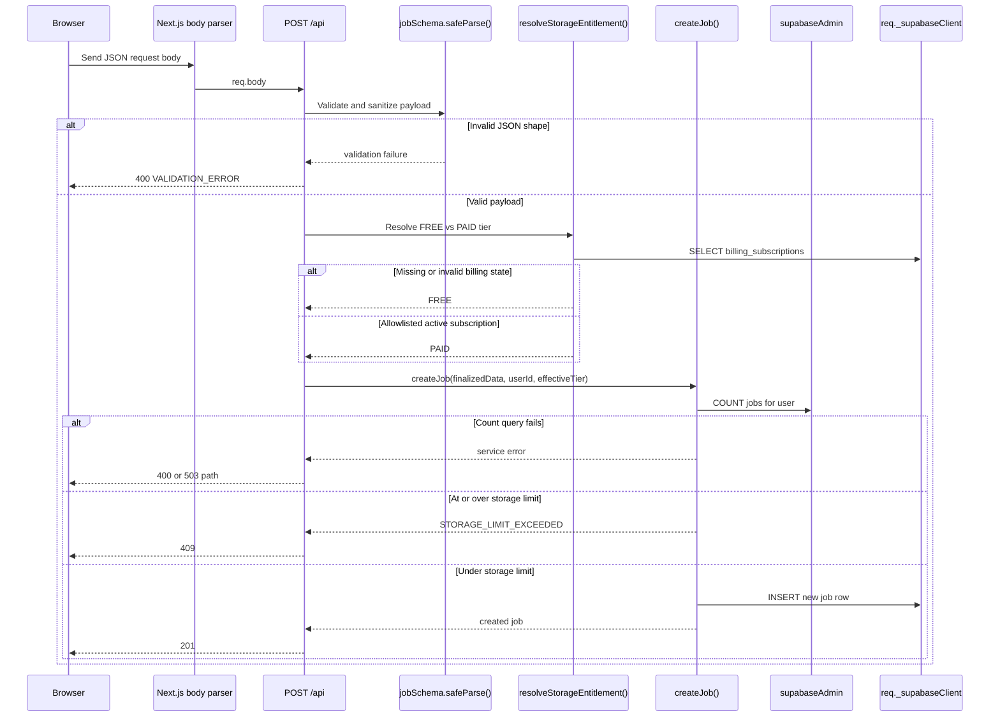
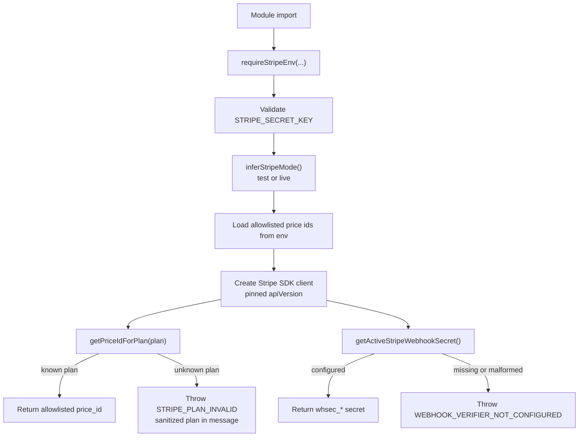
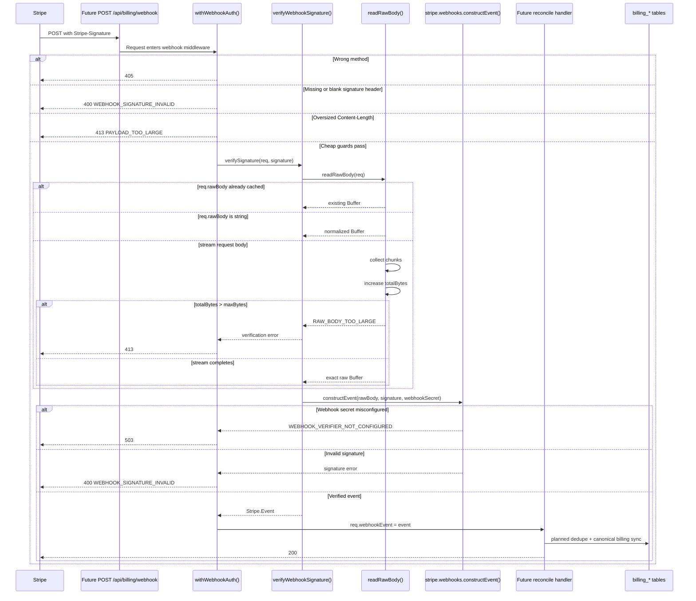
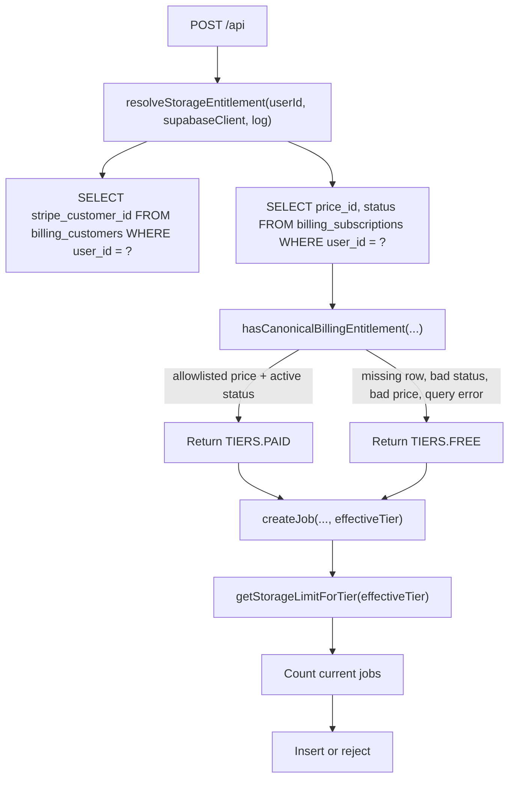

# Stripe And Request Body Architecture

## Purpose

This document explains how Stripe-related runtime code and request-body
processing work on the current branch.

It intentionally separates:

- what exists today in the codebase
- what is planned next for the public Stripe webhook route

That distinction matters because the current branch already has Stripe runtime
foundations, raw-body verification helpers, local billing entitlement reads,
billing reconciliation helpers, and billing database tables, but it does not
yet include the public `POST /api/billing/webhook` route described in the next
Stripe plan.

## Current State Summary

The current branch already has:

- Stripe runtime configuration and allowlisted plan-to-price lookup in
  `src/server/lib/stripe.js`
- raw-body buffering with byte-cap enforcement in
  `src/server/lib/readRawBody.js`
- Stripe signature verification in
  `src/server/lib/webhookSignature.js`
- webhook middleware for cheap rejection and centralized verification in
  `src/server/middleware/withWebhookAuth.js`
- billing database tables from Phase 2:
  `billing_customers`, `billing_subscriptions`, and `stripe_event_receipts`
- local billing entitlement reads plus reconciliation helpers for customer
  mapping, Stripe subscription sync, delete snapshots, and receipt tracking in
  `src/server/lib/billingService.js`
- normal authenticated job creation using parsed JSON request bodies in
  `src/pages/api/index.js`

The current branch does not yet have:

- a live public `POST /api/billing/webhook` route
- Stripe checkout or billing portal API routes

Security difference vs next-phase plan:

- local billing entitlement is already active for job-creation storage limits,
  but the plan's rollout section expects production cutover only after local
  billing rows are backfilled or webhook/reconcile flows are live
- this is fail-closed rather than fail-open, so it does not overgrant premium
  access, but it can incorrectly deny premium storage when local billing state
  is missing or stale

## Architecture Overview



## Two Body Paths

The app currently has two important request-body models:

1. Normal app JSON bodies
2. Raw webhook bodies

### 1. Normal App JSON Bodies

For most application routes, Next.js parses the incoming HTTP body and exposes
it as `req.body`.

Example path:

- browser submits a JSON payload to `POST /api`
- `src/pages/api/index.js` reads `req.body`
- `jobSchema.safeParse(req.body)` validates and sanitizes the payload
- the route resolves premium storage entitlement from local billing data
- the route calls `createJob(...)`
- the service enforces the storage limit and inserts the row

Typical example body:

```json
{
  "company": "OpenAI",
  "position": "Software Engineer",
  "status": "applied",
  "notes": "Reached out to recruiter on LinkedIn",
  "salary_min": 140000,
  "salary_max": 180000
}
```

### 2. Raw Webhook Bodies

Stripe signature verification must use the exact original byte sequence sent by
Stripe, not parsed JSON. That is why the webhook flow is different.

Example path:

- a webhook route would disable the normal Next.js body parser
- the route would use `withWebhookAuth(...)`
- `withWebhookAuth(...)` would require the Stripe signature header before
  reading the body
- `verifyWebhookSignature(...)` would call `readRawBody(req)`
- `readRawBody(req)` would buffer the request stream into a `Buffer`
- `stripe.webhooks.constructEvent(rawBody, signature, webhookSecret)` would
  verify and parse the event

Example Stripe event payload shape:

```json
{
  "id": "evt_123",
  "object": "event",
  "type": "invoice.paid",
  "data": {
    "object": {
      "id": "in_123"
    }
  }
}
```

The important distinction is:

- normal app route: parsed object in `req.body`
- webhook route: raw bytes first, verified event second

## Normal JSON Body Flow

This is the active, current flow used by authenticated job creation.



## Stripe Runtime Foundation Flow

This flow already exists, even before the public webhook route is added.



Security difference vs next-phase plan:

- the Stripe runtime itself fails fast on missing or malformed Stripe secrets
  and allowlisted price-id env vars
- local entitlement reads in `billingService.js` still intentionally ignore
  missing price-id env vars and fail closed to `FREE`
- that is authorization-safe because it does not grant premium access on bad
  config, but it is operationally looser than the plan's stricter
  fail-fast-at-runtime direction

## Planned Webhook Raw-Body Flow

This flow reflects the existing helper code plus the route behavior described in
`docs/stripe-next-phase-plan.md`. The route itself is still planned.



Security difference vs next-phase plan:

- the helper and middleware foundation already enforce raw-body verification,
  method gating, missing-signature rejection, and body-cap rejection
- the billing service layer now has the canonical customer-mapping, stale-event,
  receipt, and Stripe-fetch reconciliation helpers the route will call
- the route-level protections the plan depends on are not live yet because the
  public webhook route does not exist on this branch
- that means livemode mismatch rejection and the actual public event ingress are
  still absent from runtime behavior even though the downstream service helpers
  now exist
- this is primarily a missing-protection gap rather than an implemented
  contradiction, because the public webhook surface itself is not yet exposed

## Why Raw Body Verification Exists

Webhook verification uses the raw body because cryptographic signature checks are
byte-sensitive.

If the app were to parse and re-serialize JSON before verification:

- key order could change
- whitespace could change
- encoding details could change
- the verified payload would no longer exactly match what Stripe signed

That is why the planned webhook route must use:

- `export const config = { api: { bodyParser: false } }`
- `withWebhookAuth(...)`
- `readRawBody(req)`
- `verifyWebhookSignature(...)`

## Current Entitlement Flow

Today, local billing data already affects application behavior even before the
public webhook route exists.



Security difference vs next-phase plan:

- this flow already follows the plan's core security rule that local billing
  state, not auth metadata, decides premium storage behavior
- however, the plan's rollout section assumes this entitlement switch should not
  become authoritative in production until paid-user billing rows are backfilled
  or webhook/reconcile coverage is live
- in its current form, a missing local subscription row causes a paid user to
  fall back to `FREE`, which is a fail-closed authorization outcome but still a
  user-impacting security and rollout difference from the intended cutover order

## File Map

These are the main files that define the current architecture:

- `src/server/lib/stripe.js`
- `src/server/lib/readRawBody.js`
- `src/server/lib/webhookSignature.js`
- `src/server/middleware/withWebhookAuth.js`
- `src/server/lib/billingService.js`
- `src/server/services/jobService.js`
- `src/pages/api/index.js`
- `docs/stripe-phase2-handoff.md`
- `docs/stripe-next-phase-plan.md`

## Key Takeaway

The main architectural rule is:

- Stripe events do not directly grant access

Instead, the intended model is:

1. verify Stripe webhook authenticity from the raw request body
2. reconcile canonical local billing tables from trusted server-side logic
3. read local billing tables to decide entitlements and storage behavior

That keeps premium access tied to trusted local state rather than mutable
redirects, partial webhook payloads, or client-controlled request bodies.
